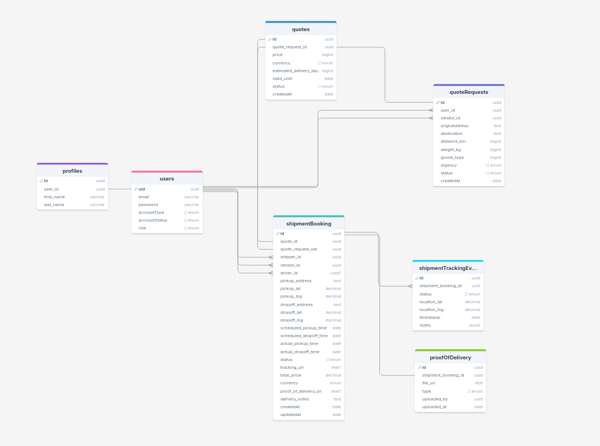

# 📦 Supply Chain Management System
A full-stack Supply Chain Management application built to support logistics operations such as shipment quotes, bookings, vendors, and delivery — built with modern web technologies

## 🎯 Project Overview
This is a full-stack, open-source supply chain management web application that allows shippers to request quotes for deliveries, receive responses from logistics vendors, and manage shipments through to delivery. The project is intended as an educational tool and practical foundation for real-world logistics platforms.

## 👥 Account Types & Roles
The platform supports multiple account types and granular roles, enabling flexible and secure collaboration across different user types. 

### 1. Shippers
 Businesses or individuals who need goods transported.

#### Roles:
- shipper: Full access to the shipper company dashboard. Can manage team members, request quotes, view shipments, and handle billing.

### 2. Vendors (Logistics Companies)
 Companies that own or manage fleets and fulfill delivery requests.
 #### Roles:
- vendor: Full access to the vendor dashboard. Can respond to quote requests, manage pricing, vehicles, drivers, and view payouts.
- driver: Delivery personnel who are assigned shipments and report delivery progress (via mobile or web).

### 3. Platform Admins
Internal users who maintain the platform infrastructure.
#### Roles:
- platform_admin: Superuser with access to all accounts, configurations, audits, pricing policies, and system-wide actions.

### 🔐 Role-Based Access Highlights

| Role              | Request Quotes | Respond to Quotes | Manage Drivers | Book Shipments | Admin Access        |
|-------------------|----------------|-------------------|----------------|----------------|---------------------|
| `shipper`   | ✅             | ❌                | ❌             | ✅             | ✅                  |
| `vendor`    | ❌             | ✅                | ✅             | ❌             | ✅                  |
| `driver`   | ❌             | ❌                | ❌             | ❌             | 🚚 Driver-only      |
| `platform_admin`  | ✅             | ✅                | ✅             | ✅             | 🔥 Super Admin      |

## 🔐 Authentication & Role Management
- Users sign up once and may have multiple roles (e.g., a vendor admin who is also a shipper).
- Role-specific dashboards are presented after login.
- RBAC (Role-Based Access Control) is enforced on all endpoints and UI views.

## 🔐 User Flow: Authentication (Signup & Login)
This section outlines how users authenticate on the platform, including signup, login, and role access handling.

### Platform Admin registration & onboarding  flow

#### 📌 Step 1: Admin Registration
- Only one `platform_admin` is allowed.
- A verification email is sent after registration.

#### 📧 Step 2: Verify Email
- The admin verifies their email to activate the account.
- Gains access to the platform admin dashboard.

### Customer

#### 📝 Step 1: User Signup
- Users visit the `/signup` page and enter:
- Optionally, the user selects their intended **primary role** (e.g., `shipper`, `vendor`).
- The user is sent a verification email 
- The user verifies their email to active the account

#### 🔐 Step 2: User Login
- Users visit the login page and provide the necessary credentials
---

## 🧭 User Flow (Quote to Delivery)

This section outlines the end-to-end journey from quote request to final delivery.

### 📌 Step 1: Shipper Requests a Quote

- The shipper fills out a **quote request form** with:
  - Origin & destination
  - Goods type
  - Weight (kg)
  - Urgency (`standard` or `express`)
- The system creates a `quote_request` with a unique reference number (e.g., `QR-20250729-0012`).
- Status: `pending`

### 📌 Step 2: Vendor Views and Responds

- Vendors view available or assigned quote requests.
- A vendor submits a `quote` with:
  - Price
  - Currency
  - Estimated delivery days
  - Validity window (expiry date/time)
- The quote is linked to the original request and given a `quote_number` (e.g., `Q-20250729-0005`).
- Status: `active`

### 📌 Step 3: Shipper Accepts or Rejects

- The shipper receives one or more quotes for their request.
- They can either:
  - **Accept** a quote → moves to booking
  - **Reject** one or all quotes → vendors are notified
- Accepted quotes are locked; others may be marked `rejected` or `expired`.

### 📌 Step 4: Shipment is Booked

- Upon accepting a quote:
  - A `shipment_booking` is created
  - A `shipment_number` is generated (e.g., `SHP-000154`)
  - Booking is linked to shipper, vendor, and the accepted quote
- Status: `booked`

### 📌 Step 5: Vendor Assigns Driver (Optional)

- The vendor assigns a driver from their fleet.
- Shipment status changes to: `assigned`

### 📌 Step 6: Pickup and Delivery

- The driver marks the shipment as picked up → Status: `in_transit`
- Real-time updates (location, notes, timestamps) can be logged
- Upon delivery:
  - Proof of delivery (image, signature) is submitted
  - Shipment marked as `delivered`

### 📌 Final States

- `delivered`: Shipment successfully completed
- `cancelled`: Manually cancelled by shipper or vendor
- `failed`: Attempted delivery failed (wrong address, customer unavailable, etc.)

---

## Technical Details

### 🧰 Tech Stack
- Backend: NestJS + PostgreSQL + DrizzleORM
- Frontend: Nuxtjs + NuxtUI + TailwindCSS
- Auth: JWT-based authentication (support for roles)
- Tracking: Google Maps API (optional)
- Notifications: (Planned) Twilio / SendGrid integration for alerts

### 🛢️Database structure
PostgreSQL is the database of choice. See link below for detailed diagram  
Link here - [https://drawsql.app/teams/team-ize/diagrams/supply-chain-ms]

## 📝 API Documentation 
This project uses OpenAPI for documentation. See link below
Link here - [https://supply-chain-ms-api.koyeb.app/api]

