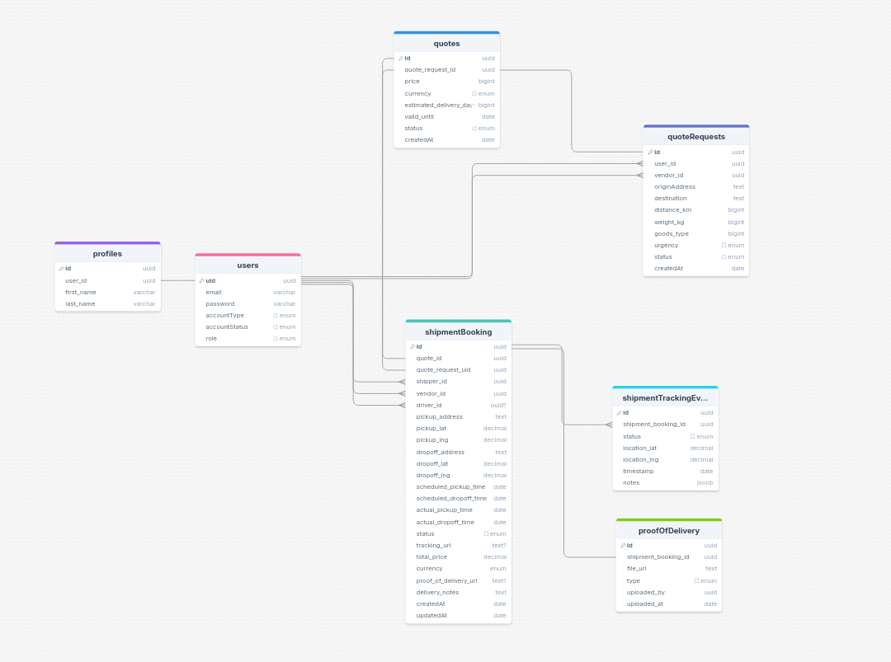

# Supply chain management system 🚚

A full-stack Supply Chain Management application built to support logistics operations such as shipment tracking, quote requests, driver assignment, and admin oversight. It’s designed for multi-role usage including shippers, logistics vendors, fleet managers, and platform administrators.

## 💫 Core Features
- Submit and respond to transport quote requests
- Manage shipment orders with pickup/delivery scheduling
- Status updates
- Admin panel for platform administrator, user i.e shipper and vendor 
- Clean API structure for future mobile app or third-party integrations
- Modular architecture with clear separation of concerns, designed for easy scaling and future multitenancy
- Support for role-based access control (RBAC) to manage permissions for Admins, Shippers, Vendors and Drivers

## 🧰 Tech Stack
- Backend: NestJS + PostgreSQL + DrizzleORM
- Frontend: Nuxtjs + NuxtUI + TailwindCSS
- Auth: JWT-based authentication (support for roles)
- Tracking: Google Maps API (optional)
- Notifications: (Planned) Twilio / SendGrid integration for alerts

## Database architecture
PostgreSQL is the database of choice. See link below for detailed diagram  
Link here - [https://drawsql.app/teams/team-ize/diagrams/supply-chain-ms]

## API Documentation 
This project uses OpenAPI for documentation. See link below
Link here - [https://supply-chain-ms-be.koyeb.app/api]

## User flow 🚧

## Useful links
[Introduction] (./docs/1-introduction.md)

